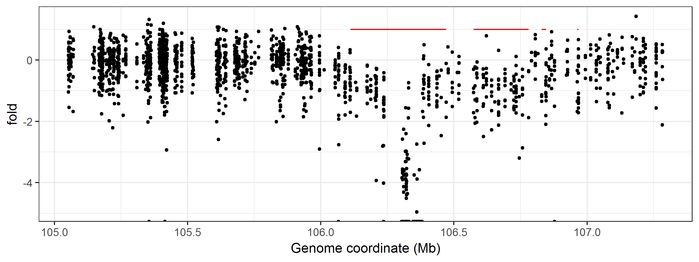

Copy-number variant calling
---------------------------

The blck files produced by `nimbus_count.py` can also be used as input to call copy-number variants (CNVs) based on the depths of individual amplicons. To call CNVs we use the [ExomeDepth](https://cran.r-project.org/web/packages/ExomeDepth/index.html) tool from Pagnol *et al* which was published in *Bioinformatics* in 2012.

To call CNVs, a reference set is required that can either be created from a directory with `blck` files or by adding `blck` to a reference set one-by-one. The Rscripts to perform these actions can be run via the commandline as follows:

```bash
Rscript nimbus_exomedepth_create_reference_from_directory.R \
  --reference referenset.txt \
  --input directory_with_block_files

Rscript nimbus_exomedepth_add_reference.R \
  --reference referenset.txt \
  --input sample.blck
```

After a reference set is obtained, CNVs can be called with the `nimbus_exomedepth.R` script. Via the command-line parameters, many parameters of ExomeDepth can be set (see example and the [ExomeDepth manual](https://cran.r-project.org/web/packages/ExomeDepth/index.html)). In hybridisation based assays, longer exons should yield more reads. This is not likely to be true for amplicon based assays. Therefore, the bin width in the `select.reference.set` function is set to 1. The `nimbus_exomedepth.R` script saves the calls from ExomeDepth, the selected datasets, and the amplicon statistics compared to the selected reference samples. The `nimbus_exomedepth.R` script can be used as follows:

```bash
Rscript nimbus_exomedepth.R \
  --reference referenset.txt \
  --input sample.blck \
  --output sample.cnv_calls.txt \
  --threshold 10 \
  --nbins 10000 \
  --transition 10^-4 \
  --selection sample.selection.txt \
  --amplicons sample.amplicons.stats.txt
```

 Currently, CNV calling has not been implemented in a workflow. However, if the blck files are located in the current directory, the BASH commands below can be used to run the ExomeDepth on many files. Note that the `/path/to` text needs to be changed out with the path to the `nimbus_exomedepth.R` script

 ```bash
for file in `ls *.blck`; do
  sample=${file/.blck/}
  echo "Processing ${sample} with nimbus_exomedepth.R"
  Rscript /path/to/nimbus_exomedepth.R \
    --reference referenset.txt \
    --input "${sample}.blck" \
    --output "${sample}.cnv_calls.txt" \
    --threshold 10 \
    --nbins 10000 \
    --transition 10^-4 \
    --selection "${sample}.selection.txt" \
    --amplicons "${sample}.amplicons.stats.txt" ;
done
 ```

We have performed CNV on sample NA15510 using 5 other samples as a small reference set. Even-though this reference set is very small, some CNVs could still be called. The results from this analysis are linked [here](exomedepth_cnv_calls.txt). The top hits and their relative coverage are shown below.



**Figure** CNVs called with ExomeDepth CNVs are shown in red. The fold change relative to the reads per million signal in the reference samples are depicted as black dots.

To create the figure the following R code was used.

```R
tf <- with(amplicon, chromosome == "chr14" & start >= 105000000 & end <= 108000000)
tx <- with(cnv_calls, chromosome == "14" & start >= 105000000 & end <= 108000000)

amplicon[tf,] %>%
  ggplot(aes(x=start/1000000, y = fold)) +
  geom_point(size = 1) +
  geom_segment(aes(x = start/1000000, xend = end/1000000, y = 1, yend = 1), colour = "red", data = cnv_calls[tx, ]) +
  theme_bw() +
  xlab("Genome coordinate (Mb)")
ggsave("figures/NA15510_chr14_CNV.png", width = 8, height = 3, dpi = 300)
```
